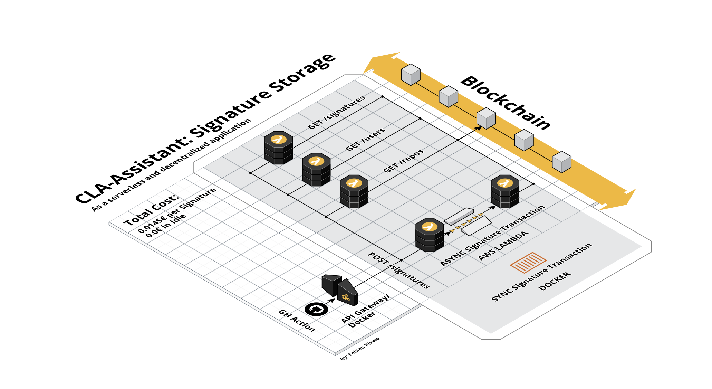

# CLA-Assistant: Decentralized Signature Storage
These Blockchain Services provide the option to store CLA Signatures on the [Ethereum Blockchain](https://de.wikipedia.org/wiki/Ethereum).  

## Motivation
To optimize data security the [GitHub Actions based CLA Handling](https://github.com/cla-assistant/github-action/blob/master/README.md) leverages Smart Contracts on the Ethereum Blockchain by storing CLA Signatures in the corresponding Distributed Ledger. 

# Usage
## Prerequisites

- AWS Account (when run in serverless mode)
- Ethereum Wallet (when deployed on ethereum-blockchain) with some Ether for the [gas fee / transaction fee](https://ethereum.stackexchange.com/questions/3/what-is-meant-by-the-term-gas)
- Blockchain Access (ganache, infura, truffle develop, etc.)

## How it works

Whenever a user signs a CLA in the repository, 
an automated process (e.g Github Action) will send the data to an endpoint, which inserts the data into a blockchain. 
The API is written in node.js with express. 
We used the serverless framework (AWS) for cost optimization. 
There is also the option to run the application in a [Docker Container](https://github.com/cla-assistant/blockchain-services/blob/master/Dockerfile). We highly recommend to use it as a serverless application.

## Smart Contract

The documentation of the smart contract can be found [here](./docs/index.md).
Use `npm run soldity-docgen` to regenerate the docs.

## Setup

1. Create a `.env`-File
2. Add the following variables:
* `MNEMONIC` (_required_): Your crypto-wallett mnemonic or private key
* `ENDPOINT` (_required_): Your blockchain endpoint
* `SQS_QUEUE_URL` (_optional_): The URL of the AWS SQS Queue (only when in serverless)

## Local development
1. In the `.env`-File set the `ENDPOINT` to `http://127.0.0.1:9545/`
2. Run the following command:
    * `truffle develop`
    * `> migrate`
    * _Open new terminal_ 
    * `npm serve`
    * _Open new terminal_
    * `cd client`
    * `npm serve`

## Endpoints

- GET /health -> used for healthcheks, always returns 200.
- GET /status -> the contract can be paused. Can be checked via this endpoint.
- GET /signatures -> use `signature_id` as query parameter to get a single signature
- POST /signatures -> endpoint for GitHub-Action to connect to
- GET /users -> use `user_id` as query parameter to get all signatures by a GitHub user
- GET /repos -> use `repo_id` as query parameter to get all signatures by a GitHub repository

## Architecture

